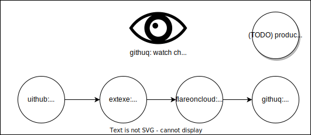

# ExtExe - The AI Compilation Layer for Natural Language Programming

We can call this ExtExe: short for 'Extension Execution'. ExtExe.com is bought.

Description: extexe is an AI Layer capable of tranforming hierarchical files into AI-generated static assets and scripts.

Goals:

- Extensions can be stacked to recursively generate derivatives from a (natural language) source.
- Keep track of dependencies between files to calculate the most efficient way of generating
- Keep track of what's been generated and what hasn't yet, with a notion of what needs to be lazy and what needs to be proactively generated. Also keep track of what needs to be re-generated when a new update comes to the source-text.
- When having a "lazy strategy", have the ability to generate and serve static files in realtime using a "generative fallback" while keeping these assets ready for the next deployment to be truly static.
- Full flexibility in choosing generation configuration (LLM and prompts) using a github template repo.
- Doing this as fast, efficient, and cheap as possible.
- Clear distinction between source 'routes' and destination 'asset paths'

Much of the above has already been implemented in iRFC-cloud, albeit using a not-so-scalable vector database, and a custom root handler as source of truth, there is not much to be added.

The interface we want is as follows:

- input:
  - github (or other) repo-branch
  - optional: a previous successful deployment date from same source to same destination
- preprocessing:
  - get files
  - calculate diff
- internal:
  - prepare file data
  - calculate workflow
  - execute workflow
- output:
  - a file object of static files for the destination
  - a lazy fallback URL (can be inside of a config file)
- post-processing:
  - submit this new output to a repo/branch on github or similar or into a zip or r2 storage object. we now just need an uithub URL as response

The beauty is that, including the pre and post-processing steps, it's a URL-to-URL function now.

The output is to be used in a way where we:

- layover the template
- add lazily generated files from r2
- bundle to a worker executable
- (re)deploy.

The full high-level flow looks like this:

TODO:

- ✅ Start with iRFC cloud and extract as much as we can use. See `syncBranch`, `irfc-admin/deploy`, `set` for the main blocks
- Create uithub GET `/compare` API. Extrahere the compare functionality from iRFC-cloud to uithub as it's generally useful
- Create uithub POST `push/owner/repo/branch({fileObject,isPartial:boolean})` to easily push a commit to a branch, including partial updates. 🤔 Even though this creates entirely generated code on github and may be messy, if we have to choose between using github or making our own, github is likely better since it's much more easy to observe things and it's free anyway. Later we can add our own storage solution if this isn't desired in certain cases.
- Use the above endpoints to create the main `extexe` GET endpoint that streams results until done, or immediately pushes everything from a URL if it's already there (no changes). Finish an initial version of this URL-to-URL workflow
- https://github.com/CodeFromAnywhere/calculator + https://github.com/codefromanywhere/microflare-template = API + Website with 100% Reliability
