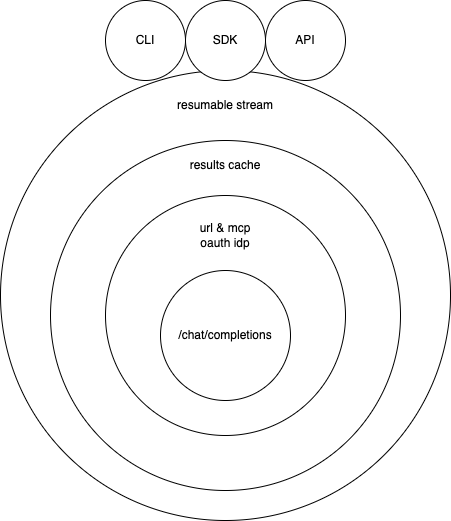

# Redefine goals

- needs possibility of configuration in `nlang.json` or `package.json`
- needs secure way of storing LLM API keys
- needs oauth flows for all URLs including MCP ones. URL fetching should be done with authorization.
- needs programmatic way of using it as well as CLI
- needs `.nlang` with generation cache
- should be able to work fully offline or on intranet
- should be able to define file-level verification functions
- should introduce SPEC.md convention
- should it be flexible in that it can refer to itself? should prevent infinite loops though!

The main goal is for this to become more open and more enterprise-ready. In the end, developers want things to be deterministic and want not to rely on any untrusted third party that may introduce risk.

# TODO

- Create a simpler CLI focusing on the enterprise-readiness, leaving out the dependencies
- fs cli is thin wrapper, authed formdata-stream is another
- Focus on an example of ci/cd for an npm package and for deploying files to another "shadow"-branch.

# ADR

There are many layers to this and it's a challenge creating a unified chat completions thing that works for any chat completions endpoint, nicely layering modular pieces on top of it for different runtimes. Yet, this should be the goal!

Using standard github CI stuff, we can do this each time we push, saving slow generation time: https://letmeprompt.com/rules-httpsuithu-anfpnk0
